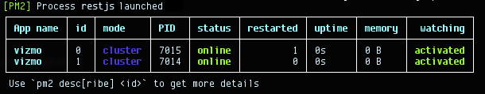

NODEjs Process Manager
======================

This document will provide essential information for setting up the run-time NodeJS process.


# TL;DR
Install the [PM2](https://github.com/Unitech/pm2) v.0.10+ as root:

```bash
$ sudo ./npm install pm2@latest -g --unsafe-perm
```

Scripted start: run with the following in the folder of the NodeJS app:

```bash
$ pm2 start up.json
```

Manual start: run with the following in the folder of the NodeJS app:

```bash
$ pm2 start rest.js -i 4 -f --name "vizmo" --watch -o ./vizmo-log.log -e ./vizmo-error.log -p ./vizmo.pid
```


***

# Full Documentation

## Module
Module [PM2](https://github.com/Unitech/pm2) v.0.10+ will be used as a process manager.

## Installation
Run the following as a root:

```bash
$ npm install pm2@latest -g --unsafe-perm
```

This will install the global module.

## Starting the PM2 instance (` JSON Startup Script `)
Recommended way to start the pm2 processes:

```bash
$ pm2 start up.json
```

up.json:
```JSON

    {
      "apps" : {
        "name"        : "vizmo",
        "script"      : "rest.js",
        "log_date_format"  : "YYYY-MM-DD HH:mm Z",
        "watch"       : "true",
        "ignoreWatch" : ["[\\/\\\\]\\./", "node_modules"],
        "instances"  : "max",
        "error_file" : "./vizmo.log",
        "out_file"   : "./vizmo-err.log",
        "pid_file"   : "./vizmo.pid",
        "exec_mode"  : "cluster_mode"
      }
    }

```

**Note**: The script above needs environment specific configuration. It can also be modified to run more than 1 app.

## Starting the PM2 instance (` CLI `)
To run the Vizmo App via PM2 use the following command:

```bash
	$ pm2 start rest.js -i 4 -f --name "vizmo" --watch -o ./vizmo-log.log -e ./vizmo-error.log -p ./vizmo.pid
```



When running with log output options ` -o ./log `, you can check if the pm2 is running with:

```bash
	$ pm2 ping
```

## Stopping/Restarting the process
To stop the PM2, run the following
```bash
	$ pm2 stop vizmo          # Stops the Vizmo App
	$ pm2 reload vizmo        # Reload without downtime
```

## Monitoring
Use the following for monitoring:

```bash
	$ pm2 monit               # Monitor all processes
```


## Deployment
The PM2 instance will run with the ` watch ` flag. It will monitor the file changes and restart itself automatically with 0 downtime. No need to stop/restart unless otherwise noted by developers.

## Process Controls

```bash
	$ pm2 stop 0              # Stop the process 0
	$ pm2 stop all            # Stop all processes
	$ pm2 restart 0           # Restart process 0
	$ pm2 restart all         # Restart all processes
	$ pm2 reload all          # Emediate restart/reload
	$ pm2 delete 0            # Delete process 0
	$ pm2 delete all          # Delete all processes
```

## Other Commands
```bash
	$ pm2 list                # List processes
	$ pm2 describe 0          # Show more information about process 0
	$ pm2 logs                # Display all processes logs in streaming
	$ pm2 ilogs               # Advanced logs display
	$ pm2 flush               # Delete all logs
```

## Updating PM2
Run the following as root:

```bash
	$ pm2 updatePM2 --unsafe-perm
```

**Note**: Do not update the PM2 without the consulting with devs. Updating to a new untested version may result in the application halt/breaking.

## Documentation
[PM2 documentation](https://github.com/Unitech/pm2)

